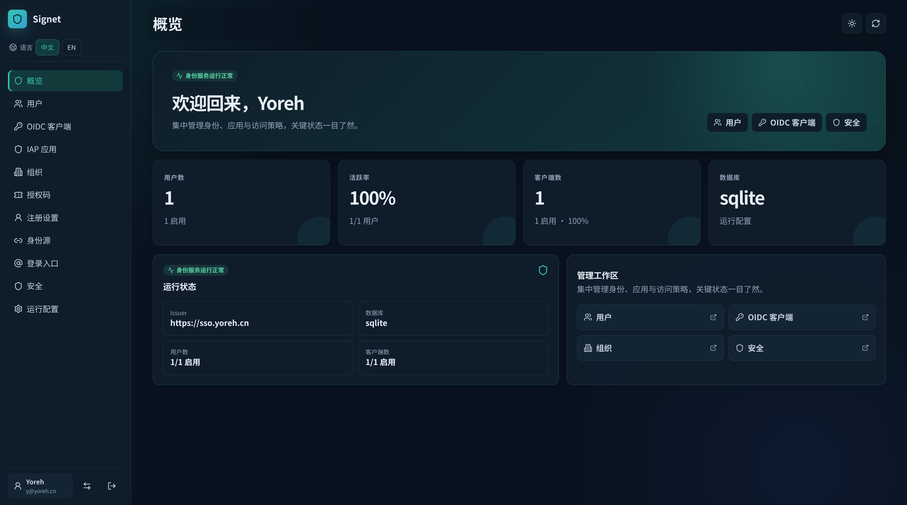
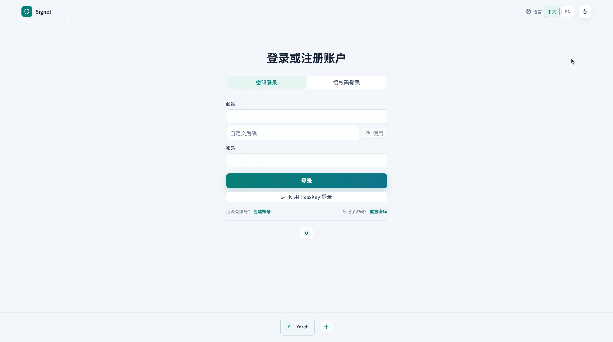
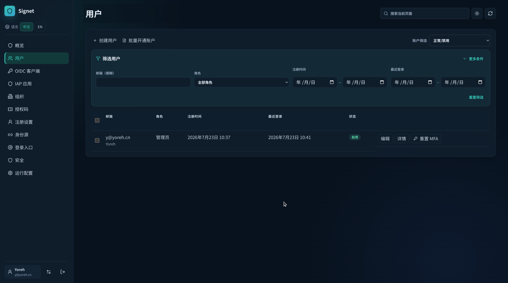

# Signet

一个自托管的身份认证中心和 OIDC Provider。用一个统一的登录入口管理用户、组织和应用访问，让你的应用不必各自维护一套账号体系。

Signet 提供可直接使用的管理控制台，覆盖账号生命周期、企业、网站应用、协议连接、身份源、目录同步、权限、安全策略和审计；登录端支持密码、Passkey、MFA 与企业身份源。



## 快速开始

最快的方式是运行容器。首次访问时注册的第一个用户会自动成为管理员。

```bash
docker run --rm -p 8080:8080 \
  -v signet-data:/app/data \
  ghcr.io/yoreh/signet:latest
```

然后打开 <http://localhost:8080/>，创建管理员账号。数据保存在 `signet-data` 卷中；用于生产前，请继续完成 [部署指南](docs/deployment.md) 中的公网地址、安全和备份配置。

从源码运行需要 Rust、Node.js 22 和数据库所需的系统库。Nix 环境可一条命令完成准备：

```bash
nix-shell --run "cargo run"
```

服务会自动构建并嵌入管理前端，无需再启动一个 Vite 服务。

## 接下来做什么

1. 在控制台的“运行配置”中设置实际的公网 Base URL 和 OIDC Issuer。
2. 创建或切换到你的企业，在“网站应用”中接入网站。应用默认对所有活跃 Signet 账户开放，用户不需要加入应用；再在应用工作区分别配置协议、第三方登录适配器、LDAP/AD、SCIM 和网站权限。
3. 让应用从 `/.well-known/openid-configuration` 读取 OIDC discovery 文档。

完整步骤见 [部署指南](docs/deployment.md) 和 [OIDC 应用接入](docs/oidc-integration.md)。

## 适合的场景

- 为内部工具、Web 应用和 API 提供统一登录与单点登录。
- 在一个控制台里管理用户、组织、角色、应用和登录安全策略。
- 接入 Google、Microsoft Entra ID、Keycloak、authentik、ZITADEL、Logto 或 LDAP/AD。
- 使用 OIDC、SCIM、IAP/ForwardAuth 或设备授权连接已有系统。

## 核心能力

| 领域 | 你可以做什么 |
| --- | --- |
| 账号与安全 | 密码登录、Passkey、TOTP MFA、恢复码、密码重置、会话管理与登录审计。 |
| 身份与组织 | 管理用户生命周期、可切换的多企业成员关系和角色；内置受保护的 Signet 系统企业。 |
| 应用接入 | 一个应用对应一个网站，把 OAuth 2.0/OIDC、SAML 2.0、CAS、JWT、第三方登录、LDAP/AD、SCIM 和网站权限捆绑在同一接入包中。 |
| 企业集成 | 外部 OIDC 登录适配器、LDAP/AD、SCIM 2.0、IAP/ForwardAuth、审计 Webhook 和服务账号。 |

<p align="center">
  
  
</p>

## 文档

- [文档导航](docs/README.md)：按任务查找部署、接入、运营与安全说明。
- [部署指南](docs/deployment.md)：容器、源码、反向代理、数据库、配置与上线检查。
- [OIDC 应用接入](docs/oidc-integration.md)：应用注册、discovery 和授权码流程。
- [安全指南](docs/security.md)：Cookie、CORS、CSRF、反向代理与密钥保护。
- [完整技术参考](docs/technical-reference.md)：协议扩展、API 示例、数据模型行为和开发验证。

## 开发

前端位于 `frontend/`，后端位于 `backend/`。本地检查命令：

```bash
npm --prefix frontend run check
SSO_SKIP_FRONTEND_BUILD=1 cargo test --workspace --all-features
```

更完整的开发环境、数据库 feature、浏览器 smoke test 和当前验证范围请见 [技术参考](docs/technical-reference.md#开发环境)。
